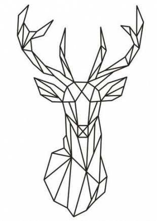
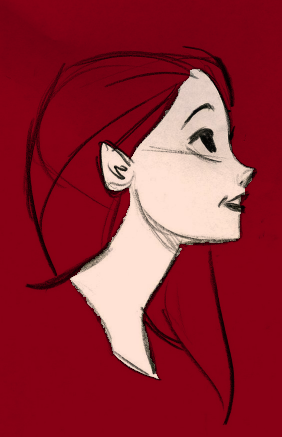

<h3>Advanced Interactive Image Editing course assignments</h3>

<h4>/hw01</h4>
Basic image operations: negative, brightness, gamma, contrast, etc.

   

    
    
    
   

   
<h4>/hw02</h4>
Fourier transform.

   

    
    

<h4>/hw03</h4>
Gaussian convolution.

   

    
    
    

<h4>/hw04</h4>
Bilateral image filter.

   

    
    

<h4>/hw05</h4>
Gauss-Seidel iterations for composing correctly exposed image from an over and an under-exposed input.

   

    
    
    

<h4>/hw06</h4>
Paint-like image coloring using segmentation (and flow min-cut).

   

    
    
	
	
	

	